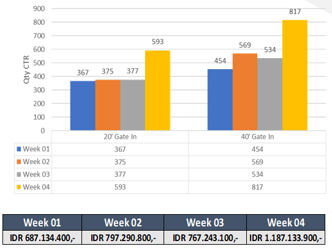
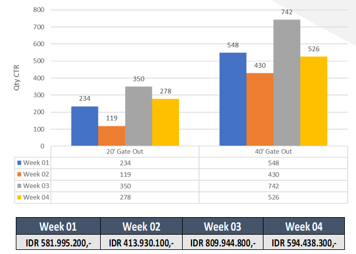
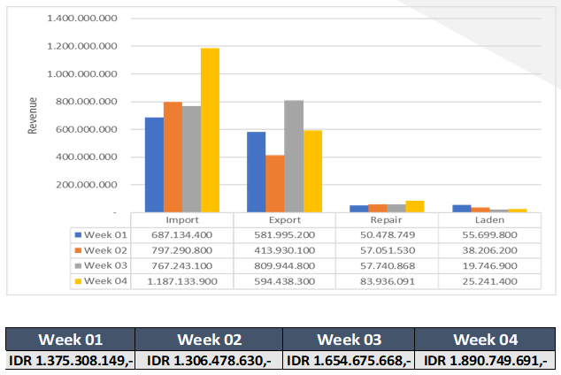
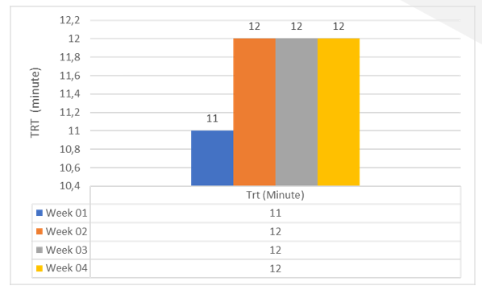
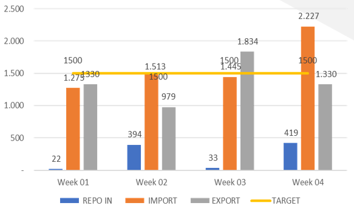
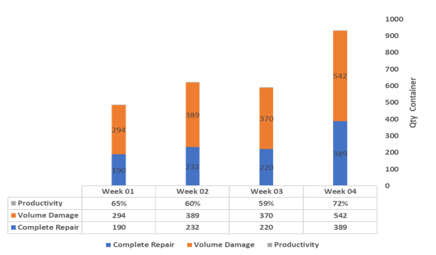
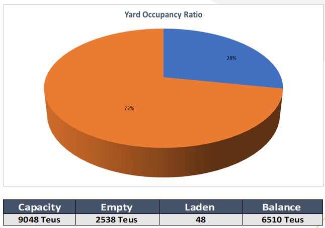

# Operational-Visualization-Report
Report ini bertujuan untuk mempresentasikan aktivitas operasional depot container selama seminggu.
## Data Cleaning
- Data diperolah dari sistem internal depot container (DMS)

## Data Visualization
### Inbound and Revenue
Grafik ini menampilkan data container yang masuk/import dan pendapatan yang diperoleh setiap minggunya.

### Outbound and Revenue
Grafik ini menampilkan data container yang keluar/export dan pendapatan yang diperoleh setiap minggunya.

### Revenue Export & Import
Grafik ini memperlihatkan pendapatan dari masing-masing aktivitas operasional yang ada dalam depot yang dibagi kedalam setiap minggu. 

- Import, yaitu aktivitas container masuk.
- Export, yaitu aktivitas container keluar.
- Repair, yaitu perbaikan container.
- Laden, yaitu aktivitas container keluar khusus container yang memiliki muatan.

### TRT (Turn Time Trucking)
TRT yaitu waktu tunggu yang setiap truck dalam melakukan aktivitas export dan import.

### Target Export & Import
Grafik ini memperlihatkan perbandingan antara valume export, import dibandingkan dengan target yang ingin dicapai perusahaan.

### Repair Productivity
Grafik ini menunjukkan produktivitas dari kegiatan perbaikan container setiap minggunya. Jadi setiap container yang rusak memiliki KPI 5 hari harus sudah selesai, untuk container masuk yang rusak dan belum sempat diperbaiki akan beralih perbaikannya di minggu berikutnya.

### YOR (Yard Occupancy Ratio)
Grafik ini menunjukkan persentasi lapangan kosong dangan lapangan yang terisi container. 

- Biru, kapasitas lapangan yang terpakai untuk empthy dan laden container.
- Orange, kapasitas yang masih kosong.
- Kapasitas lapangan 9048 Teus (3.7 ha)

